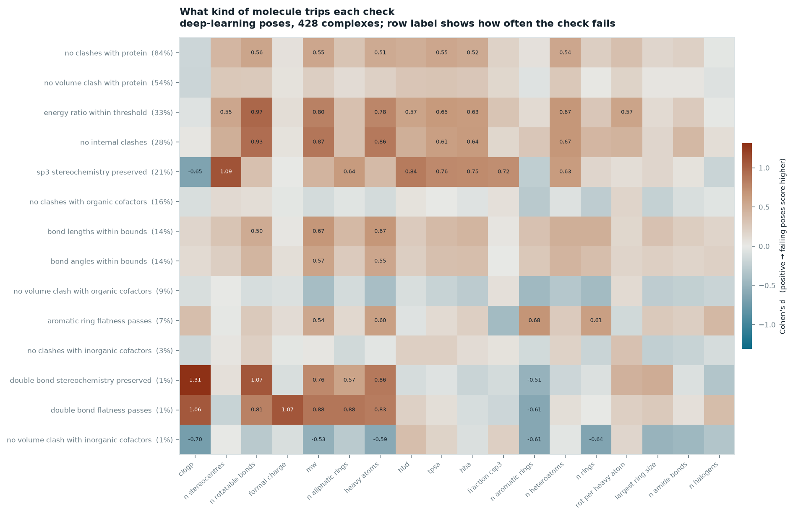

# Which molecules break docking predictions

Joining per-ligand chemistry onto the PoseBusters benchmark results, to ask a
question the published table cannot: not *which method* fails, but *which
molecules* it fails on.

---

## What was done

The PoseBusters paper ships a results table with every validity check and RMSD
for 7 docking methods across 513 complexes — but no chemistry. It carries a PDB
code, a chemical-component code, a cofactor flag and a sequence identity, and
nothing else about the molecule being docked. The crystal ligands themselves sit
in the same Zenodo archive as unanalysed SDF files.

So: compute 28 RDKit descriptors from each crystal ligand, join them onto all
7,695 pose rows, and partition the failures by ligand chemistry.

All 513 ligands parsed and sanitized without error. The analysis below uses the
428-complex PoseBusters Benchmark set and, unless stated, raw (un-minimised)
poses.

## Headline, reproduced

| Method | Class | RMSD ≤ 2 Å | Valid | Both | Of accurate poses, invalid |
|---|---|---|---|---|---|
| AutoDock Vina | classical | 52.3% | 97.4% | 51.2% | **2.2%** |
| CCDC Gold | classical | 51.2% | 93.9% | 47.7% | **6.8%** |
| DiffDock | deep learning | 37.9% | 24.1% | 13.6% | **64.2%** |
| Uni-Mol | deep learning | 22.9% | 5.6% | 1.9% | **91.8%** |
| DeepDock | deep learning | 17.8% | 8.2% | 4.7% | **73.7%** |
| TankBind | deep learning | 15.0% | 4.7% | 2.6% | **82.8%** |
| EquiBind | deep learning | 2.6% | 0.9% | 0.2% | **90.9%** |

This matches the paper. Everything below is new.

---

## Finding 1 — the gap widens with flexibility, and only with flexibility


Among poses that already passed RMSD ≤ 2 Å, the share that are physically
invalid, by ligand class:

| Rotatable bonds | Classical | Deep learning |
|---|---|---|
| 0–2 | 1.8% | 64.0% |
| 3–5 | 4.3% | 76.7% |
| 6–9 | 5.8% | 82.6% |
| 10+ | 9.4% | **100%** (0 of 20 accurate poses valid) |

Monotone in both classes, and five-fold across the range for classical methods
too — so this is a property of the docking problem, not only of neural networks.
Deep-learning methods just start from a far worse baseline and hit the floor.

**The dissociation is the interesting part.** Ring count is essentially flat
(78% → 74% → 75% → 81% → 73%), and molecular weight is noisy and non-monotone
(68% → 83% → 76% → 87%). Rotatable-bond count correlates with ring count at only
ρ = 0.27, so these partitions are close to independent, and only the flexibility
one carries a trend. It is not molecular complexity in general — it is torsional
freedom specifically.

### Control: flexibility, not size

Molecular weight and rotatable bonds correlate at ρ = 0.73, so the trend above
could be size in disguise. Holding weight fixed separates them — strain-check
failure rate for deep-learning poses:

| MW band | 0–2 rot | 3–5 rot | 6–9 rot | 10+ rot |
|---|---|---|---|---|
| < 300 Da | 7% | 24% | 37% | 53% |
| 300–400 | 27% | 27% | 42% | 68% |
| 400–500 | — | 24% | 41% | 69% |
| 500+ | 32% | 33% | 52% | **75%** |

The rate climbs left-to-right inside *every* weight band. Reading down a column
instead, the size effect is much weaker. The driver is torsional freedom.

---

## Finding 2 — each check has a chemical signature



Cohen's *d* for every (check, descriptor) pair on deep-learning poses — positive
means failing poses score higher on that property. The strongest associations:

| Check | Fails | Strongest descriptor | *d* | Failing vs passing |
|---|---|---|---|---|
| sp3 stereochemistry preserved | 21% | stereocentres | **1.09** | 4.7 vs 1.7 |
| internal energy ratio | 33% | rotatable bonds | **0.97** | 7.5 vs 4.3 |
| no internal clashes | 28% | rotatable bonds | **0.93** | 7.6 vs 4.4 |
| bond lengths within bounds | 14% | molecular weight | 0.67 | 464 vs 357 Da |
| aromatic ring flatness | 7% | aromatic rings | 0.68 | 2.7 vs 1.8 |
| no clashes with protein | 84% | rotatable bonds | 0.56 | 5.7 vs 3.7 |

Read as a diagnosis rather than a table:

- **Stereochemistry failures are a stereocentre-count phenomenon**, and nothing
  else. Molecules with ~5 stereocentres — sugars, macrolides, peptidic ligands —
  get their chirality inverted. Ligands with none obviously cannot fail. This is
  the one failure that is not geometry at all: the output is a different
  compound, often the inactive or toxic enantiomer.
- **Strain and self-overlap are flexibility failures**, the two cleanest
  effects in the matrix. More torsions, more ways to fold a molecule into itself.
- **Protein clash is nearly universal** (84% of DL poses) and therefore weakly
  associated with everything — it is the background failure mode, not a
  signature.
- **Cofactor clashes run backwards** (*d* ≈ −0.3 to −0.45 on aromatic rings and
  ring count): it is the *small, non-aromatic* ligands that collide with
  cofactors, presumably because they bind in pockets where a cofactor is a
  co-occupant rather than a bystander.


The per-check breakdown shows how differently these degrade. Strain failure runs
10% → 25% → 44% → 72% across flexibility bins; internal clash 7% → 61%. Aromatic
ring flatness barely moves (5% → 11%) — planarity is a local property that does
not care how floppy the rest of the molecule is.

---

## Finding 3 — two traps in the published data

Both would silently corrupt any naive re-analysis.

**Blank ≠ False.** Both flatness columns are empty for all 2,996 energy-minimised
rows — the checks were not run. Reading blanks as failures makes every minimised
pose invalid, producing the nonsensical result that minimisation destroys 100% of
poses *including AutoDock Vina's*. Handled correctly:

| Method | Valid, raw | Valid, minimised | Δ |
|---|---|---|---|
| DiffDock | 24.1% | 65.0% | **+40.9** |
| EquiBind | 0.9% | 32.5% | +31.5 |
| Uni-Mol | 5.6% | 36.0% | +30.4 |
| AutoDock Vina | 97.4% | 82.9% | **−14.5** |
| CCDC Gold | 93.9% | 79.9% | −14.0 |

Minimisation repairs most of what deep learning breaks and barely moves RMSD —
the distortions were local, and a force field undoes local distortions. It
*costs* the classical methods ~14 points, of which ~2 is minimisation itself
failing to produce output. The minimised column is computed over 16 checks
against 18, so it is not strictly like-for-like.

**No output ≠ perfect output.** 85 rows have every check blank: the method
produced no pose at all. Since no check is False, a naive `all(checks)` scores
them **valid**, inflating validity rates. `pose_produced` guards this — it is
worth 0.5–0.7 points on several methods and ~2.5 points across the minimised
rows, where output failures are more common.

---

## Limits

- Descriptors come from the crystal ligand, so they describe the molecule that
  was docked, not the pose that came back. That is the right choice for
  partitioning, but it means nothing here measures how *wrong* a pose is beyond
  the binary checks.
- The 10+ rotatable-bond cell holds 20 accurate deep-learning poses. The "100%
  invalid" is real but rests on a small denominator.
- These are the paper's published check results, not re-run. The predicted poses
  were never released, so the checks cannot be independently recomputed from this
  archive.
- 428 complexes, as archived. The journal version reports on a 308-complex subset
  with crystal contacts removed; that subset's IDs are not in this archive.

## Reproduce

```bash
uv venv --python 3.11 .venv
uv pip install --python .venv/bin/python rdkit pandas pyarrow matplotlib
export PYTHONPATH=src
.venv/bin/python -m pb.descriptors   # 513 ligands -> descriptors.parquet
.venv/bin/python -m pb.build         # join -> poses_joined.parquet (7,695 rows)
.venv/bin/python -m pb.analyze       # 14 tables -> reports/tables/
.venv/bin/python -m pb.figures       # 3 figures -> reports/figures/
```

Source data: [Zenodo 8278563](https://zenodo.org/records/8278563). Method:
Buttenschoen, Morris & Deane, *Chem Sci* **15**, 3130 (2024),
[doi:10.1039/D3SC04185A](https://doi.org/10.1039/D3SC04185A).
