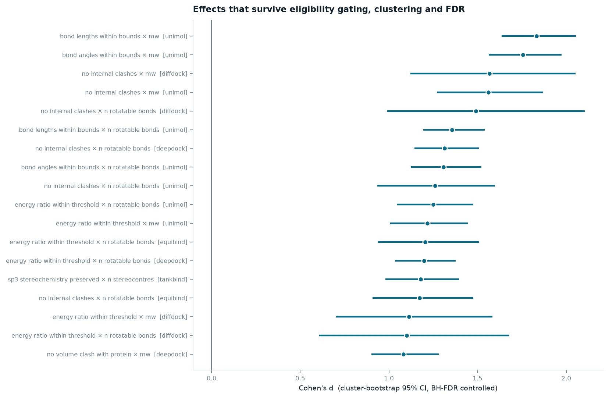
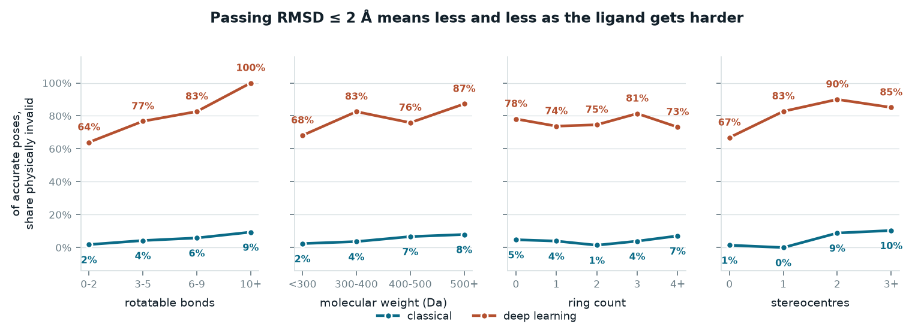
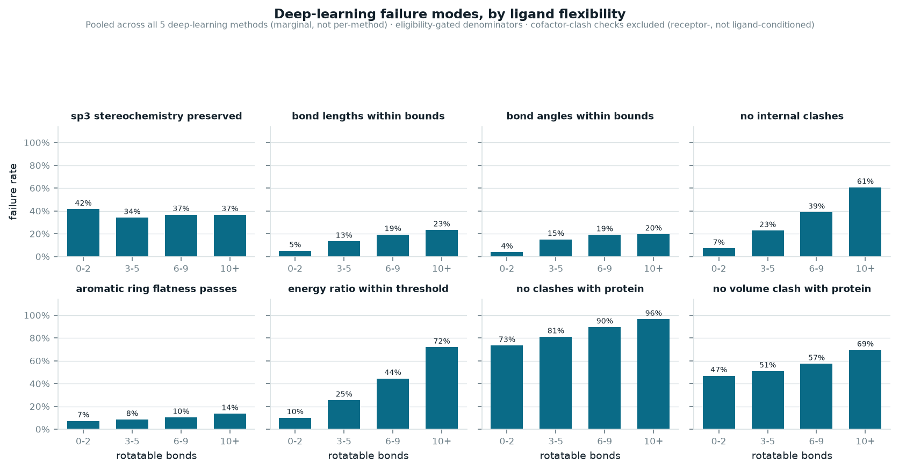

# Which molecules break docking predictions

Joining per-ligand chemistry onto the PoseBusters benchmark results, to ask a
question the published table cannot: not *which method* fails, but *which
molecules* it fails on.

**This is a revised report.** An earlier version of this document made three
claims that do not survive scrutiny once the estimates are eligibility-gated,
clustered by ligand, corrected for multiple testing, and checked against a
held-out dataset. Those claims are retracted below, not softened. Everything
else has been recomputed on the corrected machinery and every number here
traces to a table under `reports/tables/`.

---

## What was done

The PoseBusters paper ships a results table with every validity check and RMSD
for 7 docking methods across 513 complexes — but no chemistry. It carries a PDB
code, a chemical-component code, a cofactor flag and a sequence identity, and
nothing else about the molecule being docked. The crystal ligands themselves sit
in the same Zenodo archive as unanalysed SDF files.

So: compute 27 RDKit descriptors from each crystal ligand, join them onto all
7,695 pose rows, and partition the failures by ligand chemistry.

All 513 ligands parsed and sanitized without error. The analysis below uses the
428-complex PoseBusters Benchmark set and, unless stated, raw (un-minimised)
poses.

## Headline, reproduced

| Method | Class | RMSD ≤ 2 Å | Valid | Both | Of accurate poses, invalid |
|---|---|---|---|---|---|
| AutoDock Vina | classical | 52.3% | 97.4% | 51.2% | **2.2%** |
| CCDC Gold | classical | 51.2% | 93.9% | 47.7% | **6.8%** |
| DiffDock | deep learning | 37.9% | 24.1% | 13.6% | **64.2%** |
| Uni-Mol | deep learning | 22.9% | 5.6% | 1.9% | **91.8%** |
| DeepDock | deep learning | 17.8% | 8.2% | 4.7% | **73.7%** |
| TankBind | deep learning | 15.0% | 4.7% | 2.6% | **82.8%** |
| EquiBind | deep learning | 2.6% | 0.9% | 0.2% | **90.9%** |

Source: `reports/tables/method_summary.csv`. This matches the paper and is not
in dispute — nothing below changes it.

---

## Retracted

**The cofactor-clash finding is withdrawn.** The earlier version of this
report claimed that cofactor-clash checks (`no_clashes_with_organic_cofactors`
and related) run "backwards" — that small, non-aromatic ligands are the ones
that collide with cofactors — citing *d* ≈ −0.29 (95% CI [−0.45, −0.12],
*p* = 0.0005 on `no_clashes_with_organic_cofactors` × `n_aromatic_rings`,
pooled across every complex regardless of whether it has a cofactor at all).

That pooling was the error. 1,683 of the 2,987 rows this check runs on belong
to complexes with **no cofactor at all**, where the check passes almost
automatically (2.4% failure vs. 22.5% where a cofactor is actually present —
derived from the `n_eligible`/`n_fail` counts in `cofactor_retraction.csv`'s
pooled and conditioned rows). A pooled contrast against that population mostly
measures whether the receptor has a cofactor at all, not the ligand property
it claims to. Restricting to
complexes that actually have a cofactor — the only population in which this
check can be informative — collapses the effect: *d* = −0.03 (95%
CI [−0.21, 0.16], *p* = 0.765). The interval straddles zero by a wide margin.

Source: `reports/tables/cofactor_retraction.csv` (pooled vs. conditioned, same
check/descriptor pair, same bootstrap procedure). The per-method,
cofactor-conditioned breakdown in `reports/tables/association_grid.csv` shows
the same picture: of the 77 method × cofactor-check × descriptor combinations
estimable at all, only one (`tankbind`, `no_clashes_with_organic_cofactors` ×
`clogp`, *d* = 0.41) survives BH-FDR, and it is unrelated to the original
aromaticity/ring-count claim. **There is no reliable cofactor-chemistry signal
in this data.** The finding is deleted, not restated more cautiously.

---

## Finding — crystal contacts: the audit's prediction, not supported

The published PoseBusters Benchmark ships 428 complexes; the journal version
reports on a 308-complex subset after removing ligands that contact a
crystallographic symmetry mate, on the reasoning that such contacts could
inflate the protein-clash failure rate (an artifact of crystal packing, not of
the docked pose). That 308-ID list was never released, so the flag is
recomputed here from first principles: expand each deposited structure by its
spacegroup and measure the closest approach between the ligand and any
symmetry image of the protein (`src/pb/crystal_contacts.py`).

104 of 427 resolvable complexes (one, 7PA4, is permanently unresolvable — a
CCD-name mismatch between the archive and the deposited entry) have a
genuine protein contact within 4.0 Å; a broader measure that also counts
solvent/cryoprotectant symmetry mates flags 119. These two numbers bracket the
paper's reported 120 removed — an independent estimate, not a reproduction of
their exact list.

**The audit's hypothesis was that clash failure would be *inflated* among
contact-bearing complexes. With a cluster-bootstrap interval on the
contact-minus-no-contact difference (resampling complexes within each
method's stratum, 2,000 replicates, seed 0), that prediction is not
supported: exactly one of seven methods shows a significant difference, and
it runs in the *opposite* direction to the prediction.**

| Method | Contact | No contact | diff (pp) | 95% CI (pp) | Significant? |
|---|---|---|---|---|---|
| Uni-Mol | 68.9% (71/103) | 86.1% (278/323) | −17.1 | [−27.0, −7.7] | **yes, opposite direction** |
| DiffDock | 61.2% (63/103) | 70.5% (227/322) | −9.3 | [−19.6, +1.8] | no |
| TankBind | 77.9% (81/104) | 85.1% (275/323) | −7.3 | [−16.2, +1.6] | no |
| DeepDock | 91.3% (94/103) | 85.1% (275/323) | +6.1 | [−0.9, +12.5] | no |
| EquiBind | 96.1% (99/103) | 98.4% (317/322) | −2.3 | [−6.6, +1.2] | no |
| CCDC Gold | 2.9% (3/102) | 5.0% (16/322) | −2.0 | [−5.9, +2.4] | no |
| AutoDock Vina | 0.0% (0/104) | 0.6% (2/323) | −0.6 | [−1.5, 0.0] | no |

Source: `reports/tables/crystal_contact_sensitivity.csv`. Only Uni-Mol's
interval excludes zero, and its direction is *lower* clash failure among
contact-bearing complexes — the reverse of what the audit predicted, not a
confirmation of it. The other six methods, DeepDock included, are
indistinguishable from zero; none of their point estimates should be read as
a direction. Vina's and Gold's rows are the clearest illustration of why:
Vina's entire contribution is 2 failing poses out of 323 no-contact rows (0
of 104 contact rows), and Gold's is 16 of 322 versus 3 of 102 — at those
counts a "direction" is not a finding, it is noise from a handful of poses.

This is reported as a **prediction that is not supported by this data**, not
quietly dropped. A plausible reading of the one significant result is that
Uni-Mol's contact-bearing ligands are, on average, smaller or bind in tighter
pockets that also happen to reduce protein clash — but this data cannot
distinguish that from other explanations, and no such claim is made here.
Among contact-bearing complexes, the closest symmetry approach averages
3.13 Å (`reports/tables/crystal_contact_distances.csv`, computed only over
complexes flagged as contact-bearing — averaging the raw distance column over
*all* complexes is wrong, because "no symmetry neighbour found within the
search radius" is stored as `float("inf")`, not as a measurement, and would
silently corrupt any wider mean).

**Bottom line: audit issue #4 (crystal contacts inflate protein-clash
failure) is not supported by this data.**

---

## Finding — gated, clustered, FDR-controlled effects

Of the 126 method × check strata that could in principle be tested (7 methods
× 18 checks), only **41 had enough failures and enough distinct ligands to
estimate at all** (`reports/tables/stratum_coverage.csv`); the other 85 were
skipped for one of three reasons: **59 because the check never failed on that
method at all** (`no_failures` — e.g. no classical-method run has enough
double-bond-flatness failures to test), **25 because it failed too few times
to trust an interval** (`too_few_failures`, fewer than 15 failures), and
**1 because too few distinct ligands carried it** (`too_few_ligands`, fewer
than 30 clusters). A fourth category the coverage logic also checks for —
every eligible pose failing (`all_failed`), a real result a two-group
contrast still cannot describe — did not occur anywhere in this data; no
stratum hit it, though the code keeps handling it in case a future rerun
does. Across those 41 strata, every
descriptor in the model basis was tested against every check, giving **287
(method, check, descriptor) estimates. Of those, 95 survive Benjamini-Hochberg
correction at α = 0.05** (`reports/tables/association_grid.csv`).



The forest plot above shows the 18 largest surviving effects by |*d*|. Read it
as: *these are the marginal associations that remain after gating, clustering
and multiple-testing correction* — not as a ranking of which ligand property
*causes* which failure. That distinction matters here specifically:
`mw` and `n_rotatable_bonds` both appear, repeatedly, as large, FDR-surviving
marginal effects on the *same* check for the *same* method — Uni-Mol ×
`bond_lengths_within_bounds` shows *d* = 1.83 for `mw` and *d* = 1.36 for
`n_rotatable_bonds`; Uni-Mol × `no_internal_clashes` shows *d* = 1.56 for `mw`
and *d* = 1.26 for `n_rotatable_bonds`. That is not two independent findings —
it is one signal counted twice, because the two descriptors correlate at
*ρ* ≈ 0.73–0.74 within every method's ligand set
(`reports/tables/mw_rotb_correlation.csv`, `mw`/`n_rotatable_bonds` rows).
Marginal comparisons cannot tell
these apart. The clustered logistic models in `reports/tables/check_models.csv`
— one model per check per method, all seven descriptors entered together —
are what arbitrate this, and the next section reports what they say for the
question this project set out to answer. **Where the grid and the models
disagree, the models govern.** Five of the 46 fitted model strata fall below
this project's own ≥15-failure floor (`gold` ×
`energy_ratio_within_threshold`, n_fail=3; `deepdock`, `diffdock`,
`equibind` and `unimol` × `no_clashes_with_inorganic_cofactors`, n_fail
11–12) — they are not dropped, but are flagged `estimable=False` in
`reports/tables/check_models.csv` so a reader applying the same gate to the
models that this project applies to the grid can identify and exclude them.

Surviving checks, by count: `no_internal_clashes` (19), `no_clashes_with_protein`
(17), `no_volume_clash_with_protein` (17), `energy_ratio_within_threshold` (15),
`bond_lengths_within_bounds` (8), `bond_angles_within_bounds` (7),
`sp3_stereochemistry_preserved` (7), `aromatic_ring_flatness_passes` (4),
`no_clashes_with_organic_cofactors` (1, the tankbind/clogp effect above).
`sp3_stereochemistry_preserved` is worth reading carefully, because its
7 surviving pairs repeat the exact trap called out above. The marginal grid
shows `n_stereocentres` surviving for both TankBind (*d* = 1.18, 95%
CI [0.98, 1.39]) and Uni-Mol (*d* = 0.84), but also `clogp` (TankBind
*d* = −0.97, Uni-Mol *d* = −0.55), `n_halogens` (both methods) and, for
Uni-Mol, `n_aromatic_rings` — four descriptors that all look like they explain
the same failures. They co-survive because `n_stereocentres` and `clogp`
correlate at *ρ* ≈ −0.55 in this ligand set
(`reports/tables/mw_rotb_correlation.csv`, `n_stereocentres`/`clogp` rows):
molecules with more stereocentres tend to be less lipophilic, so a marginal
contrast cannot tell which one is doing the work. The clustered logistic
model resolves it
(`reports/tables/check_models.csv`): `n_stereocentres` is the only descriptor
with independent signal for either method (TankBind *p* = 2.0×10⁻⁷, Uni-Mol
*p* = 1.7×10⁻⁵), and every other descriptor — `clogp` included — has
*p* > 0.05 for both. The conclusion is the same one the `mw` /
`n_rotatable_bonds` discussion draws: the marginal grid cannot separate
correlated descriptors, and crediting it as if it could is the same mistake
in miniature. It is the model, not the grid, that shows stereochemistry
failure is a stereocentre-count phenomenon and not also a lipophilicity or
halogen-count one.

---

## Finding — flexibility vs. size: not resolvable for the method that matters most

The original claim was "flexibility, not size" — that torsional freedom, not
molecular weight, drives the strain/clash failure modes, established by
holding weight fixed and showing the failure rate still climbed with rotatable
bonds. That control cannot separate the two questions it was built to
separate, because `mw` and `n_rotatable_bonds` correlate at
**ρ ≈ 0.73–0.74 within every single method's ligand population**
(`reports/tables/mw_rotb_correlation.csv`) — not just on average across the
whole benchmark. A multivariate model, not a stratified table, is required to
ask which of the two carries independent signal, and `fit_check_model` (one
clustered logistic regression per method, both descriptors and five others
entered together) gives a per-method answer that does not agree with itself:

| Method | `mw` (energy ratio check) | `n_rotatable_bonds` (energy ratio check) | Resolvable? |
|---|---|---|---|
| **DiffDock** | *p* = 0.941 | *p* = 0.108 | **No — neither is significant** |
| EquiBind | *p* = 0.956 | *p* < 0.001 | Yes — flexibility only |
| DeepDock | *p* = 0.020 (coef. **negative**) | *p* < 0.001 | Both carry signal |
| TankBind | *p* = 0.044 | *p* < 0.001 | Both carry signal |
| Uni-Mol | *p* = 0.010 | *p* = 0.002 | Both carry signal |
| CCDC Gold | *p* = 0.471 | *p* = 0.395 | No usable signal (3 failures) |
| AutoDock Vina | — | — | No model fit (too few failures) |

Source: `reports/tables/check_models.csv`.

**DiffDock is the method the original claim was mainly about, and for
DiffDock the question is not resolvable in this data.** Neither descriptor
clears significance once the other is held fixed — despite both individually
surviving FDR in the marginal grid above (`mw` *d* = 1.11, `n_rotatable_bonds`
*d* = 1.10, both CIs excluding zero). That is exactly the collinearity failure
mode described in the previous section: two entangled predictors each look
significant alone and neither does once adjusted for the other. The honest
conclusion is that **this data cannot adjudicate size versus flexibility for
DiffDock** — not "size wins," not "flexibility wins."

**EquiBind is the only method with a clean result**, and it is also the
weakest method in the benchmark (2.6% of poses accurate, 0.9% valid — see the
headline table). Its multivariate model shows flexibility significant and
size not, on both checks tested (energy ratio and internal clashes). DeepDock,
TankBind and Uni-Mol all show *both* descriptors carrying independent signal —
DeepDock's `mw` coefficient is even negative, the opposite sign from a naive
"bigger molecules fail more" story. Gold and Vina fail too rarely for either
descriptor's contribution to be estimated at all.

**The size-vs-flexibility contrast, as originally posed, is not identified in
this dataset for the method it was meant to explain.**

---

## Validity against pose accuracy: primary and secondary views

**Primary — validity as a function of continuous RMSD, unconditioned.**
Reporting "of accurate poses, share invalid" conditions on the accuracy
outcome, which shares an upstream cause with validity (how well the method
handled that particular ligand). Conditioning on a variable like that can
induce association between things that are otherwise unrelated, so it is
demoted to secondary below. Banding the raw RMSD instead needs no such
conditioning and uses every pose, not only the ones that happened to clear an
arbitrary 2 Å cutoff (`reports/tables/validity_vs_rmsd.csv`):

| Method | ≤1 Å valid | 1–2 Å valid | 2–3 Å valid | 3–5 Å valid | 5–10 Å valid | >10 Å valid |
|---|---|---|---|---|---|---|
| DiffDock | 61.3% | 20.0% | 20.0% | 17.8% | 18.6% | 12.7% |
| Uni-Mol | 33.3% | 2.5% | 6.2% | 5.2% | 4.2% | 0.0% |
| DeepDock | 55.0% | 16.1% | 12.5% | 6.8% | 1.1% | 0.0% |
| TankBind | 36.4% | 13.2% | 3.0% | 1.8% | 0.0% | 6.9% |
| AutoDock Vina | 100% | 93.5% | 97.6% | 96.2% | 96.2% | 100% |
| CCDC Gold | 95.2% | 88.9% | 95.0% | 90.7% | 97.6% | 100% |

The deep-learning methods' validity is already poor at sub-Ångström RMSD and
does not recover at larger RMSD bands, which is a stronger and cleaner
statement than "poses that barely clear 2 Å are usually invalid" — it holds
across the whole distribution, not just at one threshold.

**Secondary — the RMSD ≤ 2 Å conditioned view (previously the primary
metric).** Kept because it is still descriptively useful and is what the
paper itself reports against, but read with the caveat above in mind:

| Rotatable bonds | Classical | Deep learning |
|---|---|---|
| 0–2 | 1.8% | 64.0% |
| 3–5 | 4.3% | 76.7% |
| 6–9 | 5.8% | 82.6% |
| 10+ | 9.4% | **100%** (0 of 20 accurate poses valid) |

Source: `reports/tables/outcome_by_rotb_bin.csv` (and the corresponding
`outcome_by_{mw,rings,stereo}_bin.csv` for the other partitions plotted in
figure 1). Monotone in both classes. Ring count is close to flat (78% → 74% →
75% → 81% → 73%) and molecular weight is noisy and non-monotone, so the
partition-level trend is specific to rotatable-bond count among these four —
but see the finding above: that observation alone does not establish that
flexibility, rather than size, is the cause, because the two are correlated
throughout the ligand set and only a multivariate model can separate them.




Figure 2's per-check denominators are eligibility-gated
(`pb.eligibility.eligible`, not merely "the check ran") — a ligand that
cannot fail a check (no stereocentres, no aromatic ring the flatness check
inspects) is excluded rather than counted as a trivial pass, which is why
`sp3_stereochemistry_preserved` reads 34-42% per bin here (36.7% pooled)
rather than an ungated 21.4%. The four cofactor-clash checks are excluded
from this figure entirely:
they are conditioned on the receptor (whether the complex carries a cofactor
at all), not on the ligand, so plotting them against rotatable-bond count
without a `has_cofactors` gate would reanimate the retracted cofactor claim
in a weaker, unlabelled form. The panels pool all five deep-learning methods
(the subtitle says so) and are marginal, not per-method, views.

---

## Validation — reproducing the crystal-structure rows with `bust`

Nothing else in this project runs a single PoseBusters check; everything
consumes the paper's published results. To check that those columns are being
interpreted correctly, `bust` (the PoseBusters package itself) was re-run on
all 513 crystal ligands against their own receptors — a redocking-free sanity
run whose expected result is near-total agreement with the paper's own
`crystal_structures` rows (`src/pb/validate.py`).

Worst-case per-check agreement across the 17 mapped checks: **99.8%**
(`reports/tables/bust_reproduction.csv`). 15 of 17 checks agree on all 513
structures; two disagree on exactly one structure each —
`aromatic_ring_flatness_passes` (7V3S: ours False, published True) and
`energy_ratio_within_threshold` (7T0U: ours True, published False — one of
the paper's own two acknowledged failures on this exact structure). The two
disagreements are on different checks, different structures, non-directional,
and individually explicable. **This project's interpretation of the published
columns is validated.**

`docked_ligand_successfully_loaded` has no single equivalent in `bust`'s own
output (it reports loading via three separate flags with no exact match) and
is excluded from the comparison for that reason, not because it disagreed.

---

## Replication — held-out Astex Diverse Set

Every effect above was discovered and estimated on the same 428 PoseBusters
Benchmark complexes. The 85 complexes in the Astex Diverse Set were never
touched during any of the analysis above, so re-estimating a shortlist of
headline (method, check, descriptor) triples there is an independent check,
not a second look at the same data (`src/pb/replication.py`).

Of 14 checkable (method, check, descriptor) triples
(`reports/tables/astex_replication.csv`):

- **13 of 14 have the same sign on Astex as on the benchmark.** Same-sign
  alone is a weak standard — **5 of those 13 pairs** have an estimate
  indistinguishable from zero on the benchmark side, the Astex side, or both
  (DiffDock/protein-clash, Uni-Mol/sp3, DeepDock/sp3, TankBind/sp3 and
  TankBind/protein-clash), so "same sign" there is not evidence of anything.
- **8 of 14 replicate with statistical support** — both the benchmark and the
  Astex interval exclude zero (`both_significant`). This is the number to
  cite for "replicates," not the 13/14 sign count.
- **2 of 14 are flagged thin** (fewer than 15 failures on one side) and should
  not be read as firm regardless of their sign or significance.
- **One pair (CCDC Gold, `no_clashes_with_protein` × `n_rotatable_bonds`) is
  not adjudicable, not a confirmed reversal.** The benchmark-side estimate is
  not significant (*d* = 0.15, CI crosses zero) and the Astex-side estimate
  rests on only 3 failures. A sign flip between two indistinguishable-from-zero
  estimates is not evidence of a real reversal; it is reported here as
  "not adjudicable" rather than as a finding.

| Effect | *d* (benchmark) | Benchmark CI excludes 0? | *d* (Astex) | Astex CI excludes 0? | Replicated? |
|---|---|---|---|---|---|
| DiffDock, protein clash × rotatable bonds | 0.60 | yes | 0.30 | no | not replicated |
| Uni-Mol, energy ratio × rotatable bonds | 1.25 | yes | 0.96 | yes | **replicated** |
| Uni-Mol, internal clashes × rotatable bonds (thin) | 1.26 | yes | 0.87 | yes | **replicated** |
| Uni-Mol, sp3 stereochemistry × stereocentres | 0.84 | yes | 0.25 | no | not replicated |
| Uni-Mol, protein clash × rotatable bonds | 0.54 | yes | 0.61 | yes | **replicated** |
| DeepDock, energy ratio × rotatable bonds | 1.20 | yes | 1.38 | yes | **replicated** |
| DeepDock, internal clashes × rotatable bonds | 1.31 | yes | 1.14 | yes | **replicated** |
| DeepDock, sp3 stereochemistry × stereocentres | 0.05 | no | 0.03 | no | not established either side |
| DeepDock, protein clash × rotatable bonds | 0.92 | yes | 0.65 | yes | **replicated** |
| TankBind, energy ratio × rotatable bonds | 0.97 | yes | 1.03 | yes | **replicated** |
| TankBind, internal clashes × rotatable bonds | 0.86 | yes | 0.47 | yes | **replicated** |
| TankBind, sp3 stereochemistry × stereocentres | 1.18 | yes | 0.17 | no | not replicated |
| TankBind, protein clash × rotatable bonds | 0.37 | yes | 0.22 | no | not replicated |
| Gold, protein clash × rotatable bonds (thin) | 0.15 | no | −1.00 | yes | **not adjudicable, not a reversal** |

The energy-ratio and internal-clash effects against rotatable bonds are the
most robust of the shortlist — significant on both sides for every DL method
tested except DiffDock (thin/marginal on the benchmark side there too). The
stereochemistry × stereocentres effect and the protein-clash × rotatable-bonds
effect are each significant on the benchmark but do not replicate with
statistical support on Astex for most methods.

---

## Two traps in the published data

Both would silently corrupt any naive re-analysis, and both are still true —
neither is contested by anything above.

**Blank ≠ False.** Both flatness columns are empty for all 2,996 energy-minimised
rows — the checks were not run. Reading blanks as failures makes every minimised
pose invalid, producing the nonsensical result that minimisation destroys 100% of
poses *including AutoDock Vina's*. Handled correctly:

| Method | Valid, raw | Valid, minimised | Δ |
|---|---|---|---|
| DiffDock | 24.1% | 65.0% | **+40.9** |
| EquiBind | 0.9% | 32.5% | +31.5 |
| Uni-Mol | 5.6% | 36.0% | +30.4 |
| AutoDock Vina | 97.4% | 82.9% | **−14.5** |
| CCDC Gold | 93.9% | 79.9% | −14.0 |

Minimisation repairs most of what deep learning breaks and barely moves RMSD —
the distortions were local, and a force field undoes local distortions. It
*costs* the classical methods ~14 points, of which ~2 is minimisation itself
failing to produce output. The minimised column is computed over 16 checks
against 18, so it is not strictly like-for-like.

**No output ≠ perfect output.** 85 rows have every check blank: the method
produced no pose at all. Since no check is False, a naive `all(checks)` scores
them **valid**, inflating validity rates. `pose_produced` guards this — it is
worth 0.5–0.7 points on several methods and ~2.5 points across the minimised
rows, where output failures are more common.

---

## Limits

- Descriptors come from the crystal ligand, so they describe the molecule that
  was docked, not the pose that came back. That is the right choice for
  partitioning, but it means nothing here measures how *wrong* a pose is beyond
  the binary checks.
- 85 of 126 method × check strata (67%) could not be estimated at all: 59
  because the check never failed on that method (`no_failures`), 25 because it
  failed too few times to trust an interval (`too_few_failures`, <15), and 1
  because too few distinct ligands carried it (`too_few_ligands`, <30
  clusters). The fourth possible reason, every eligible pose failing
  (`all_failed`), did not occur for any stratum in this data — it is handled
  by the same logic in case it ever arises, but it is not why any of these 85
  were skipped. `reports/tables/stratum_coverage.csv` records the reason for
  each. The 95 surviving effects above describe roughly a third of the strata
  that exist, not all of them.
- The size-vs-flexibility contrast is not identified for DiffDock, and Gold
  and Vina fail too rarely on most checks to fit a multivariate model at all.
  These are not gaps to be filled by more analysis of this dataset — the
  descriptors are too correlated, and the classical methods too accurate, for
  this data to answer the question.
- These are the paper's published check results for the docking methods, not
  re-run; the predicted poses were never released, so those checks cannot be
  independently recomputed from this archive. (The crystal-structure rows
  *were* independently reproduced — see Validation above — which is the
  strongest check available without the predicted poses.)
- The crystal-contact flag is this project's own first-principles estimate
  (104–119 of 428 complexes, depending on how broadly "contact" is defined),
  not a reproduction of the paper's undisclosed 308-complex subset. It
  brackets the paper's reported 120 removed but should not be read as
  identical to it.
- Several of the effects above rest on genuinely small failure counts even
  after the ≥15-failure, ≥30-cluster gate (e.g. DiffDock's `no_internal_clashes`
  effects: 25 failures). The gate rules out the thinnest strata but does not
  make every surviving one large; check `n_fail` and `n_clusters` in
  `association_grid.csv` before treating any single row as decisive, and see
  the `thin` column in `astex_replication.csv` for the same caveat applied to
  the replication shortlist.

## Reproduce

```bash
uv venv --python 3.11 .venv
uv pip install --python .venv/bin/python \
    rdkit pandas pyarrow matplotlib statsmodels gemmi posebusters pytest
export PYTHONPATH=src
.venv/bin/python -m pb.acquire            # download + unpack from Zenodo
.venv/bin/python -m pb.descriptors        # 513 ligands -> descriptors.parquet
.venv/bin/python -m pb.crystal_contacts   # symmetry-contact flags (cached under data/pdb_cache)
.venv/bin/python -m pb.build              # join -> poses_joined.parquet (7,695 rows)
.venv/bin/python -m pb.validate           # slow: reproduces the crystal rows with `bust`
.venv/bin/python -m pb.analyze            # gated, clustered, FDR-controlled tables
.venv/bin/python -m pb.replication        # held-out Astex replication
.venv/bin/python -m pb.figures            # figures -> reports/figures/
```

Source data: [Zenodo 8278563](https://zenodo.org/records/8278563). Method:
Buttenschoen, Morris & Deane, *Chem Sci* **15**, 3130 (2024),
[doi:10.1039/D3SC04185A](https://doi.org/10.1039/D3SC04185A).
